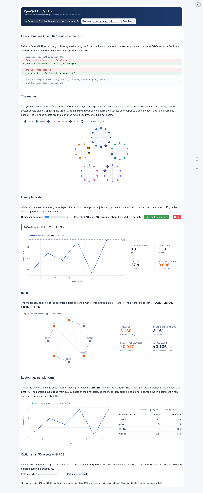

# OpenQARP on Qubitra

An interactive dashboard that runs Fujitsu's [OpenQARP](https://github.com/OpenQARP/openqarp)
portfolio diversification example on Qubitra's hosted quantum simulator, live.

OpenQARP runs its algorithms against an *engine*. Replace the local simulator with
`QubitraEngine` and the same OpenQARP code runs on the platform:

```diff
  from qarp.algorithms import QAOA
- from qarp.engines import QarpEngine
+ from qubitra.openqarp import QubitraEngine

- engine = QarpEngine()
+ engine = QubitraEngine("sim-statevector-26q-openqarp")

  qaoa = QAOA(problem=market_graph, n_layers=3, engine=engine).build()
  energy, parameters = qaoa.run()
```



## What it shows

The use case comes from OpenQARP's own notebook. A synthetic market of 50 assets across
five sectors becomes a graph, with pairwise return correlation as the edge weight.
The maximum cut of that graph pushes correlated assets onto opposite sides, so each side
is a diversified basket.

1. **The market**: the correlation network, with same-sector assets clustered.
2. **Live optimisation**: QAOA on an 8-asset sub-market, one qubit per asset. The
   convergence curve gains a point as each platform job completes. Beside it are tiles
   for jobs submitted, credits used, elapsed time and the best expected cut so far.
3. **Result**: the partition drawn on the market graph with the diversified basket
   highlighted. The basket's mean pairwise correlation is shown against the whole market
   and a random basket of the same size, and the cut against the brute-force optimum.
4. **Optional: all 50 assets with PCE**: Pauli Correlation Encoding fits the full
   problem into 5 qubits. The projected job count, credits and wall time are shown
   before anything is submitted. The resulting basket is compared with a greedy local
   search and a random split.

A Stop button halts either run before its next job. If the connection drops mid-run,
the partial convergence stays on screen and the dashboard says how many jobs completed.
Nothing is resubmitted automatically, because a retried submission is a second
charged job.

## Cost of each stage

Every objective evaluation is one platform job, at 10 credits per job and about 1.2 s
per job on the hosted simulator.

| Stage | Setting | Jobs | Credits | Wall time |
|---|---|---|---|---|
| QAOA, 8 assets | 3 optimiser iterations (default) | 13 | 130 | about 15 s |
| QAOA, 8 assets | each further iteration | +4 | +40 | +5 s |
| PCE, 50 assets | 1 restart (default) | 283 | 2,830 | about 6 min |
| PCE, 50 assets | 10 restarts, as in the notebook | about 3,760 | about 37,600 | about 75 min |

The dashboard shows the estimate for your settings before a run starts. Every circuit runs
on the platform; nothing is simulated locally.

## Getting an account and an API key

1. Ask Qubitra for an account on `https://q.cloud.qubitra.io`.
2. Sign in to the console and create an API key. The key starts with `qpk_` and is shown
   once, when it is created.
3. Put the key in your environment:

```bash
export QUBITRA_API_KEY=qpk_...
```

| Variable | Required | Meaning |
|---|---|---|
| `QUBITRA_API_KEY` | yes | Your API key. It identifies your organization. |
| `QUBITRA_API_URL` | no | The deployment to reach. Defaults to `https://q.cloud.qubitra.io/api`. |
| `QUBITRA_DEMO_MAX_PCE_RESTARTS` | no | The most PCE restarts the dashboard offers, 1 to 10. Defaults to 10. |

If `QUBITRA_API_KEY` is unset, the dashboard asks for the key in a password field. The
key stays in the running process's memory and is never written to disk or logged.

## Running it

Once the package is published:

```bash
uvx qubitra-openqarp-demo
```

From a clone of this repository, with [uv](https://docs.astral.sh/uv/):

```bash
uv run qubitra-openqarp-demo
```

The dashboard opens in your browser. `--edit` opens the same file as an editable
[marimo](https://marimo.io) notebook, `--host` picks the address to bind, `--port`
the port, and `--headless` skips opening a browser window.

## Hosting

The `Dockerfile` serves the dashboard on port 7860, the port Hugging Face Spaces expects.
`deploy/hf-space/push.sh <owner>/<space>` publishes the current commit to a Docker Space.
Give the Space two secrets:

- `QUBITRA_API_KEY`: a key from an organization whose credit balance is the demo's budget.
  Every visitor spends from it, and runs stop when it is empty.
- `QUBITRA_DEMO_MAX_PCE_RESTARTS`: `1`, so a single run costs at most about 2,830 credits.

## Development

```bash
uv sync
uv run pytest            # market, theme, job estimates, and the compute path
uv run ruff check src tests
uv run mypy
uv run marimo check src/openqarp_demo/app.py
```

The tests make no network calls: OpenQARP's local simulator stands in for the platform.

Requires `qubitra-sdk[openqarp]` 0.4.4 or later in the 0.4 series, which returns short
jobs promptly and retries a dropped submission without charging twice.

## Licence

Apache License 2.0; see [LICENSE](LICENSE). The market model, the QAOA and PCE
workflows and the classical references are adapted from OpenQARP's
`finance_portfolio_diversification.ipynb`, Copyright 2026 Fujitsu Limited, under the
Apache License 2.0; see [NOTICE](NOTICE).
